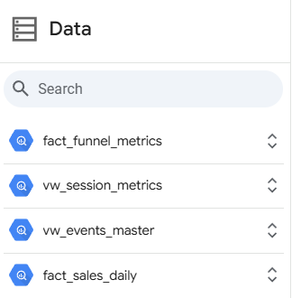
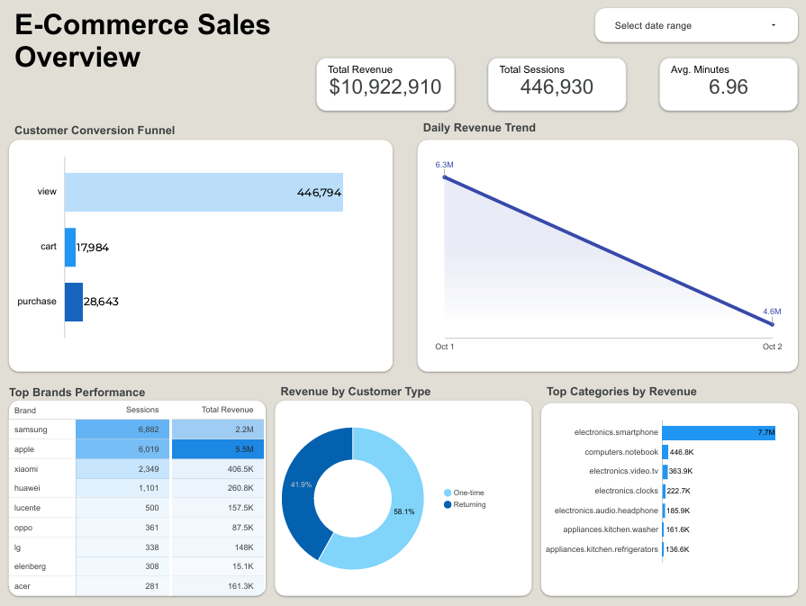

# End to End Data Engineering Project: Customer Behavior Analysis

**⚠️Work in progress⚠️**

## Table of Contents

* [Business Case](#business-case)
* [Pipeline Architecture](#pipeline-architecture)
    * [Tech Stacks](#tech-stacks)
    * [Data Pipeline Flow](#data-pipeline-flow-etl)
    * [Source Code Map](#source-code-map)
* [Data Quality](#data-quality)
* [Data Visualization](#data-visualization)
* [Challenges & Future Improvements](#challenges--future-improvements)

## Business Case

Success in the fast-paced e-commerce sector hinges on the ability to translate raw user interactions into strategic, data-driven decisions. This automated cloud pipeline is designed to bridge the gap between raw web traffic and actionable business intelligence, empowering stakeholders by:

* **Uncovering** critical bottlenecks within the customer journey. By tracking session drop-offs from initial product views to final purchases, the business gains a clear roadmap for Conversion Rate Optimization (CRO) and checkout UX improvements.

* **Monitoring** sales velocity and daily financial health. Analyzing day-over-day revenue performance allows stakeholders to instantly detect anomalies, measure the impact of promotional campaigns, and respond rapidly to sudden market shifts.

* **Evaluating** the true profitability of specific product categories and top brands. Isolating mere traffic drivers from actual high-margin revenue generators empowers the marketing team to allocate advertising budgets much more effectively.

* **Quantifying** customer loyalty and the financial impact of retention. Understanding the revenue distribution between first-time buyers and returning customers provides a solid foundation for targeted loyalty programs aimed at maximizing Customer Lifetime Value (CLV).

**Data Source:** [eCommerce behavior data](https://www.kaggle.com/datasets/mkechinov/ecommerce-behavior-data-from-multi-category-store)


## Pipeline Architecture


### Tech Stacks

* **Cloud SQL:** The core transactional database serving as the main extraction point for the raw e-commerce event logs.

* **Google Cloud Storage (GCS):** Functions as the centralized Data Lake, offering highly scalable object storage to land raw data and persist intermediate files (Parquet) throughout the Medallion Architecture phases.

* **Google BigQuery:** A serverless data warehouse configured to store the highly optimized business-level data. It employs a Star Schema to power complex analytical queries and denormalized views at high speed.

* **Dataproc (Apache Spark):** The managed distributed processing cluster utilized to execute **PySpark** jobs. It extracts, cleans, and transforms large-scale user session data into structured formats efficiently.

* **Google Compute Engine & Docker:** The foundational compute infrastructure for orchestration. Compute Engine provides the virtual machine, while Docker containerizes the Apache Airflow environment to maintain consistent and isolated workflow execution.

* **Apache Airflow:** The central orchestration platform responsible for scheduling, monitoring, and managing the end-to-end data pipelines reliably.

* **GitHub Actions:** Establishes an automated CI/CD pipeline to enforce code standards, manage GCP infrastructure provisioning via Terraform, and deploy the data workflows seamlessly into production.

* **Terraform:** Utilized as Infrastructure as Code (IaC) to automate the deployment of the Google Cloud environment. This covers setting up the source database (Cloud SQL), provisioning the Data Lake (Cloud Storage), deploying the virtual machine (Compute Engine), and configuring the data warehouse (BigQuery), guaranteeing a reproducible and scalable infrastructure.

* **Looker Studio:** The visualization platform connected directly to Google BigQuery, used to build interactive dashboards and translate complex data into actionable business insights.

### Data Pipeline Flow (ETL)

* **Extract:** The pipeline initiates by pulling raw e-commerce event logs from **Cloud SQL**. Driven by PySpark scripts and managed through **Apache Airflow** (DAGs), the ingested records are landed securely into **Google Cloud Storage (GCS)**.

* **Transform:** Data transformations are executed on Google **Dataproc** leveraging **Apache Spark**, structured around the Medallion Architecture framework to guarantee data reliability:

  * **Raw Data (Bronze):** Functions as the primary staging zone, capturing unmodified event logs exactly as it arrives to preserve a complete, historical baseline.
  
  * **Cleaned Data (Silver):** Focuses on refining the raw event logs by enforcing schemas, filtering nulls, standardizing session identifiers, and removing duplicates. The refined records are then written in the columnar **Parquet** format.
  
  * **Business-level Data (Gold):** The reporting-ready layer where cleansed data is structured into a **Star Schema** (Fact and Dimension tables). These analytical datasets are partitioned and saved as optimized **Parquet** files to maximize query efficiency.

* **Load:** The finalized analytical tables are ingested into **Google BigQuery** (Data Warehouse). To further accelerate dashboard performance, denormalized master views are built over the Star Schema, acting as the primary data source for interactive reporting in **Looker Studio**.

### Source Code Map

| Component | File Link (Source Code) | Description |
| :--- | :--- | :--- |
| **CI/CD Pipeline** | [`cicd.yml`](./.github/workflows/cicd.yml) | Defines the CI/CD workflow to automatically run code validations and deploy Terraform changes to the GCP infrastructure. |
| **Infrastructure (IaC)** | [`terraform/`](./terraform/) | Holds the IaC scripts (`main.tf`, `cloudsql.tf`, `compute.tf`, `gcs.tf`, `bigquery.tf`) responsible for setting up all Google Cloud services. |
| **Container Environment** | [`docker-compose.yml`](./docker-compose.yml) | Specifies the containerization setup required to deploy and host the Apache Airflow environment reliably. |
| **Orchestration / DAGs** | [`ecommerce_pipeline.py`](./dags/ecommerce_pipeline.py) | Contains the Airflow DAG that controls the execution sequence, schedules pipeline runs, and manages task dependencies. |
| **Data Ingestion (Bronze)** | [`ingest_from_cloudsql_to_gcs.py`](./scripts/ingest_from_cloudsql_to_gcs.py) | Responsible for the initial extraction phase, pulling raw event logs from Cloud SQL and staging them in GCS. |
| **Data Cleaning (Silver)** | [`clean_bronze_to_silver.py`](./scripts/clean_bronze_to_silver.py) | Performs the core data refinement by handling nulls, standardizing session formats, and enforcing schemas before saving as Parquet. |
| **Data Modeling (Gold - Dim)** | [`create_dimension_tables.py`](./scripts/create_dimension_tables.py) | Generates the contextual dimension tables (e.g., product and user details) to support the overall Star Schema structure. |
| **Data Modeling (Gold - Fact)** | [`create_fact_tables.py`](./scripts/create_fact_tables.py) | Produces the central fact tables designed to calculate key e-commerce metrics (e.g., conversion funnels, daily revenue) for BI consumption. |


## Data Quality 

To guarantee analytical accuracy and build trust in the e-commerce datasets, stringent data validation rules were programmed directly into the cleaning PySpark script.

Silver Layer (Data Cleansing & Standardization):

  * **Type Casting & Format Standardization:** Executed precise data type conversions across all fields—such as parsing `event_time` into standard Timestamps (`yyyy-MM-dd HH:mm:ss z`) and enforcing `DecimalType(10, 2)` on financial columns (`price`)—ensuring downstream calculation accuracy.

  * **Null & Missing Value Handling:** Secured pipeline integrity by eliminating rows missing fundamental identifiers like `user_id` and `event_time`. For non-critical missing fields, logical fallbacks were injected (e.g., assigning `"Unknown"` to `brand` or `category_code`, and `0.0` to `price`).

  * **Data Integrity Checks:** Validated financial logic by deploying `.filter(col("price") >= 0)` conditions to proactively discard anomalous records with negative pricing, preserving the exactness of revenue metrics.

  * **Deduplication:** Utilized a comprehensive, multi-column .`dropDuplicates()` strategy (encompassing `user_session`, `user_id`, `event_time`, and `product_id`) to eradicate redundant event logs, guaranteeing an accurate representation of customer behavior.

## Data Visualization

### Looker Studio Data Sources

To bridge the data warehouse with the reporting layer, the optimized BigQuery tables and materialized views were directly connected to Looker Studio. This setup ensures that the dashboard queries the most efficient datasets, minimizing load times and reducing compute costs.

 

<!-- To maximize dashboard responsiveness and minimize query compute costs in Looker Studio, the underlying BigQuery Star Schema was transformed into highly optimized, denormalized master views. This approach shifts complex joins and business logic into the data warehouse, delivering analysis-ready data directly to the BI tool. -->

### Analytical Views

* **vw_events_master:** Consolidates the central fact table (`fact_events`) with product (`dim_product`) and user (`dim_user`) dimensions into a flattened structure (One Big Table). It proactively embeds critical business logic, such as classifying users into `One-time` or `Returning` segments based on their active lifespan.

    ``` SQL
    SELECT 
        f.event_time,
        DATE(f.event_time) AS event_date, 
        f.event_type,
        f.price,
        f.user_session,
        p.product_id,
        p.category_code,
        p.brand,
        u.user_id,
        u.first_active_time,
        u.last_active_time,
        TIMESTAMP_DIFF(u.last_active_time, u.first_active_time, MINUTE) AS lifespan_minutes,
        TIMESTAMP_DIFF(u.last_active_time, u.first_active_time, DAY) AS lifespan_days,
        CASE 
            WHEN TIMESTAMP_DIFF(u.last_active_time, u.first_active_time, MINUTE) < 60 THEN 'One-time'
            ELSE 'Returning'
        END AS customer_type
    FROM `project_id.ecommerce_wh_prod.fact_events` AS f
    LEFT JOIN `project_id.ecommerce_wh_prod.dim_product` AS p 
    ON f.product_id = p.product_id
    LEFT JOIN `project_id.ecommerce_wh_prod.dim_user` AS u 
    ON f.user_id = u.user_id;
    ```

    Schema Details (`vw_events_master`):

    | Field Name | Type | Description |
    | :--- | :--- | :--- |
    | `event_time` | `TIMESTAMP` | The exact UTC timestamp when the event occurred. |
    | `event_date` | `DATE` | The truncated date of the event for daily aggregation. |
    | `event_type` | `STRING` | The type of user action (e.g., view, cart, purchase). |
    | `price` | `NUMERIC` | The price of the product at the time of the event. |
    | `user_session` | `STRING` | The unique identifier for the user's browsing session. |
    | `product_id` | `STRING` | The unique identifier for the product. |
    | `category_code` | `STRING` | The categorical classification of the product. |
    | `brand` | `STRING` | The brand name of the product. |
    | `user_id` | `STRING` | The unique identifier for the registered user. |
    | `first_active_time` | `TIMESTAMP` | The timestamp of the user's very first recorded event. |
    | `last_active_time` | `TIMESTAMP` | The timestamp of the user's most recent recorded event. |
    | `lifespan_minutes` | `INTEGER` | Total active lifespan of the user measured in minutes. |
    | `lifespan_days` | `INTEGER` | Total active lifespan of the user measured in days. |
    | `customer_type` | `STRING` | Segmented as 'One-time' (< 60 mins lifespan) or 'Returning'. |

* **vw_session_metrics:** Aggregates cleansed event logs from the central fact table (`fact_events`) to the session level, calculating precise user engagement metrics to track the start, end, and overall duration of each customer's visit.

    ```SQL
    SELECT
        user_session,
        user_id,
        DATE(MIN(event_time)) AS session_date,
        MIN(event_time) AS session_start,
        MAX(event_time) AS session_end,
        COUNT(event_type) AS total_events,
        TIMESTAMP_DIFF(MAX(event_time), MIN(event_time), MINUTE) AS duration_minutes,
        TIMESTAMP_DIFF(MAX(event_time), MIN(event_time), SECOND) AS duration_seconds
    FROM `project_id.ecommerce_wh_prod.fact_events`
    GROUP BY 
        user_session, 
        user_id;
    ```
    Schema Details (`vw_session_metrics`):

    | Field Name | Type | Description |
    | :--- | :--- | :--- |
    | `user_session` | `STRING` | The unique identifier for the browsing session. |
    | `user_id` | `STRING` | The unique identifier for the user. |
    | `session_date` | `DATE` | The date when the session was initiated. |
    | `session_start` | `TIMESTAMP` | The exact timestamp of the first event in the session. |
    | `session_end` | `TIMESTAMP` | The exact timestamp of the last event in the session. |
    | `total_events` | `INTEGER` | The total number of interactions (events) during the session. |
    | `duration_minutes` | `INTEGER` | The total duration of the session in minutes. |
    | `duration_seconds` | `INTEGER` | The total duration of the session in seconds. |

### Aggregated Fact Tables (Data Marts)

<!-- To optimize Looker Studio's performance for specific high-level KPIs and minimize Data Warehouse compute costs, the pipeline generates aggregated fact tables directly from the Silver layer during the Dataproc Spark processing phase. These lightweight datasets are loaded into BigQuery, ready for instant visualization. -->

* **fact_funnel_metrics:** Aggregates the cleansed Silver data to summarize the total number of sessions for each specific stage of the customer journey (View, Cart, Purchase). This directly powers the Customer Conversion Funnel chart without requiring runtime calculations.

    Schema Details (`fact_funnel_metrics`):

    | Field Name | Type | Description |
    | :--- | :--- | :--- |
    | `event_type` | `STRING` | The stage of the e-commerce funnel (e.g., view, cart, purchase). |
    | `total_sessions` | `INTEGER` | The total count of sessions that successfully triggered the event. |

* **fact_sales_daily:** Aggregates the Silver layer transaction records to calculate total revenue on a daily basis, serving as the highly optimized data source for the Daily Revenue Trend chart.

    Schema Details (`fact_sales_daily`):

    | Field Name | Type | Description |
    | :--- | :--- | :--- |
    | `event_date` | `DATE` | The aggregated date of the e-commerce transactions. |
    | `total_sales` | `NUMERIC` | The total revenue generated on that specific date. |


### Executive Dashboard & Business Insights

This dashboard serves as the central analytical hub, translating millions of raw e-commerce event logs into an interactive narrative. It empowers stakeholders to monitor funnel health, track revenue streams, and evaluate top-performing segments at a glance.

 

* **Key Performance Indicators (KPIs):** Instantly highlights the massive scale of the platform's traffic, processing over 446K total sessions that generated $10.9M in total revenue, with users spending an average of nearly 7 minutes per session.

* **Customer Conversion Funnel:** Visualizes the user journey from initial views to final purchases. The massive volume at the 'view' stage followed by a sharp drop-off pinpoints a critical bottleneck, signaling a high-priority area for Conversion Rate Optimization (CRO) strategies. Furthermore, an intriguing anomaly emerges where `purchase` events (28,643) outnumber `cart` events (17,984). This data point strongly suggests the platform features a **"Buy Now"** or one-click checkout option, revealing how users frequently bypass the traditional cart process.

* **Daily Revenue Trend:** Captures a significant day-over-day revenue contraction, highlighting a steep 27% decline (from $6.3M to $4.6M) in a single day. This sharp variance strongly suggests a specific driving factor—such as the sudden end of a promotional flash sale, or weekend vs. weekday seasonality.

* **Brand & Category Performance:** Clearly identifies `electronics.smartphone` as the undisputed flagship category driving the most revenue. Interestingly, the *Top Brands* table reveals that while **Samsung** leads in the number of purchasing sessions (6,882 sessions), **Apple** overwhelmingly dominates in actual revenue generation ($5.5M vs $2.2M), indicating a significantly higher Average Order Value (AOV).

* **Revenue by Customer Type:** Demonstrates a healthy retention rate, showing that returning customers form the backbone of the business, contributing to the majority (58.1%) of the total revenue compared to one-time buyers.


## Challenges & Future Improvements

While this project successfully establishes a robust, automated data pipeline, several areas have been identified for future enhancement to bring the architecture to full enterprise-grade production readiness:

* **Automated Data Quality Validation:**

    * **Challenge:** Ensuring data integrity (e.g., verifying that aggregate revenues match granular event logs) currently relies on manual dashboard logic and visual inspection.

    * **Improvement:** Implement automated Data Quality checks directly within the **PySpark** processing layer. By writing custom validation rules (e.g., checking for nulls or negative prices) during the transformation phase, the pipeline can proactively enforce data integrity and quarantine anomalous records in a Dead Letter Queue (DLQ) *before* they are ingested into the BigQuery data warehouse.

* **Decoupled Architecture for Airflow Metadata:**

  * **Challenge:** Currently, the Airflow metadata database (which stores execution history and variables) runs locally within a container on the Compute Engine VM. If the VM is destroyed and recreated via Terraform, the historical state is lost.

  * **Improvement:** Migrate the metadata backend to a managed **Google Cloud SQL (PostgreSQL)** instance. This decouples the compute layer from the storage layer, ensuring persistent state even if the Airflow worker nodes are dynamically scaled or replaced.

* **Centralized Secret Management:**

  * **Challenge:** Managing credentials and environment variables requires careful handling to avoid accidental exposure in the CI/CD pipeline.

  * **Improvement:** Fully integrate **GCP Secret Manager** as the Secrets Backend for Airflow. By leveraging VM Service Accounts and IAM roles (`roles/secretmanager.secretAccessor`), the system will securely fetch database credentials and API keys at runtime without storing any sensitive strings in the codebase.

* **Migration to Fully Managed Services:**

  * **Improvement:** To reduce infrastructure maintenance overhead and improve autoscaling capabilities, future iterations of this architecture could migrate from the self-managed Compute Engine deployment to **Google Cloud Composer** (Managed Airflow).


